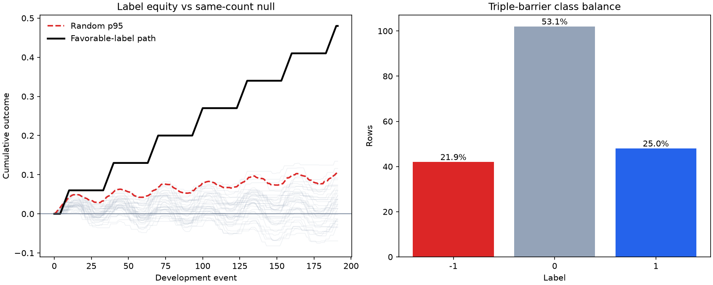
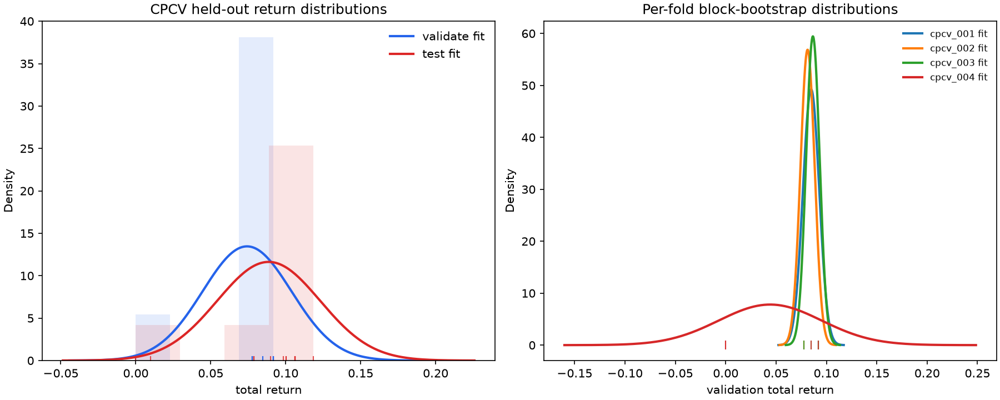
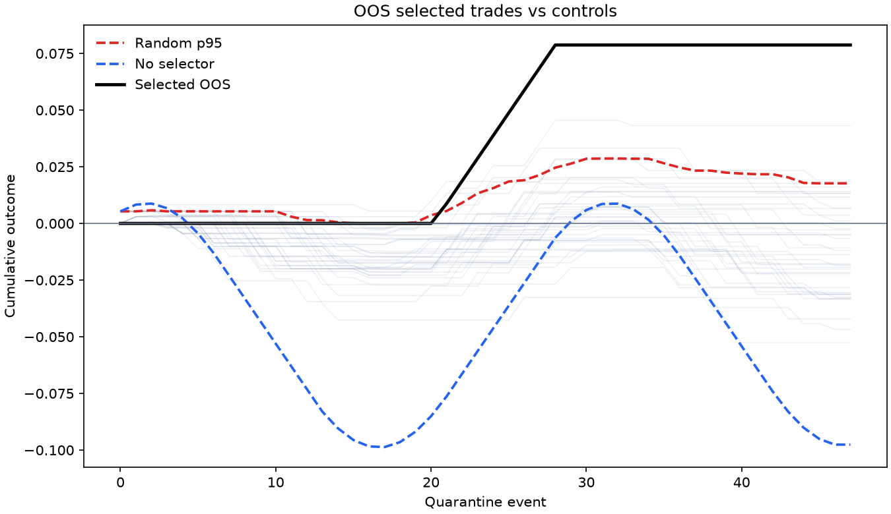
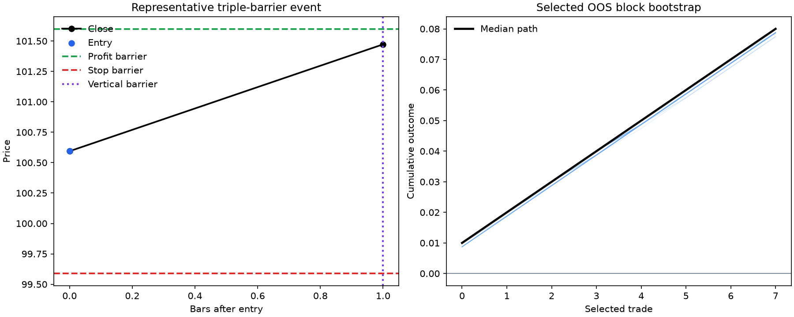

# finShell

Python validation engine for financial labels and cross-validated selectors.

## Installation

```powershell
python -m pip install .
```

The standard installation includes plotting, CPCV, block bootstrap, null tests,
triple-barrier labels, logistic selectors, and sealed out-of-sample validation.
Input columns are mapped with `ColumnRoleMap`, so source schemas do not need to
use finShell's internal names.

## Notebook Walkthrough

This deterministic example creates an original triple-barrier classification
label from synthetic OHLC data. The favorable path is deliberately constructed
to clear the label audit so the complete API can be demonstrated. It is an API
example, not evidence of a tradable edge.

<!-- notebook-example:start -->

### 1. Generate and audit the label

The first operation after creating the label is a same-count random-path audit.
The figure compares the favorable-label equity path with the null paths and
their dashed pointwise p95 boundary, then reports class balance.

```python
import numpy as np
import pandas as pd
import finshell as fs

rows = 240
signal = np.sin(np.linspace(0.0, 16.0 * np.pi, rows))
close = np.empty(rows)
close[0] = 100.0
for index in range(rows - 1):
    close[index + 1] = close[index] * (1.0 + 0.012 * signal[index])

frame = pd.DataFrame({
    "event_time": pd.date_range("2024-01-01", periods=rows, freq="1h", tz="UTC"),
    "signal_feature": signal,
    "high": close * 1.001,
    "low": close * 0.999,
    "close": close,
    "side": np.ones(rows, dtype=int),
})
study = fs.ValidationStudy(
    frame,
    roles=fs.ColumnRoleMap(
        timestamp="event_time", high="high", low="low", close="close", side="side"
    ),
    artifact_dir="assets/readme",
)
label = study.audit_label(
    fs.TripleBarrierConfig(profit_take=0.01, stop_loss=0.01, vertical_bars=1),
    null_tests=fs.NullTestConfig(
        random_simulations=300, stored_random_paths=40, random_seed=7
    ),
)
print(
    f"passed={label.passed} favorable={label.summary['favorable_count']} "
    f"real_total={label.summary['real_total']:.4f} "
    f"random_p95={label.summary['random_final_p95']:.4f} "
    f"p_value={label.summary['p_value']:.4f}"
)
```

```text
passed=True favorable=48 real_total=0.4800 random_p95=0.1035 p_value=0.0000
```



### 2. Fit inside CPCV folds

`LogisticSelector` is fitted separately on every block-bootstrap training path.
Validation and test rows are never included in those fits, and the final 20%
quarantine remains sealed. The plot shows raw fold results with fitted bell
curves for validation, test, and bootstrap distributions.

```python
cv = study.fit_selector(
    fs.LogisticSelector(
        features=["signal_feature"], threshold=0.40, random_state=13
    ),
    cpcv=fs.CPCVConfig(
        n_groups=6, holdout_groups=2, validate_groups=1, max_splits=4
    ),
    bootstrap=fs.FoldBlockBootstrapConfig(
        replicates=4, block_bars=8, random_seed=13
    ),
)
print(
    f"passed={cv.passed} valid_bootstrap_fits={cv.summary['valid_bootstrap_fits']} "
    f"validate_return={cv.summary['mean_validate_total_return']:.4f} "
    f"test_return={cv.summary['mean_test_total_return']:.4f}"
)
```

```text
passed=True valid_bootstrap_fits=16 validate_return=0.0742 test_return=0.0886
```



### 3. Audit selected quarantine trades

The already-fitted selector scores the sealed quarantine without refitting. Its
equity path must beat both same-count random selection p95 and the unfiltered
no-selector equity path.

```python
oos = study.audit_oos(
    null_tests=fs.NullTestConfig(
        random_simulations=300, stored_random_paths=40, random_seed=17
    )
)
print(
    f"passed={oos.passed} selected={oos.summary['selected_count']} "
    f"selected_total={oos.summary['selected_total']:.4f} "
    f"random_p95={oos.summary['random_final_p95']:.4f} "
    f"no_selector={oos.summary['no_selector_total']:.4f} "
    f"p_value={oos.summary['p_value']:.4f}"
)
```

```text
passed=True selected=8 selected_total=0.0787 random_p95=0.0177 no_selector=-0.0976 p_value=0.0000
```



### 4. Validate economic paths

The last stage block-bootstraps only the selected quarantine outcomes. The left
panel displays the configured horizontal profit/stop barriers and vertical time
barrier. The right panel shows Monte Carlo paths with the pointwise median in
black.

```python
economics = study.validate_economics(paths=300, block_bars=4, random_seed=23)
print(
    f"passed={economics.passed} paths={economics.summary['bootstrap_paths']} "
    f"terminal_p05={economics.summary['terminal_p05']:.4f} "
    f"terminal_p50={economics.summary['terminal_p50']:.4f} "
    f"terminal_p95={economics.summary['terminal_p95']:.4f}"
)
```

```text
passed=True paths=300 terminal_p05=0.0787 terminal_p50=0.0800 terminal_p95=0.0800
```



<!-- notebook-example:end -->

## Data Assumptions

- Input may be a pandas DataFrame, CSV file, or Parquet file.
- Timestamps must be parseable; ingestion normalizes them to UTC and sorts them.
- `ColumnRoleMap` maps user-defined column names into the validation contract.
- OHLC and side columns are required when finShell generates triple-barrier labels.
- Outcomes are additive per-event returns used for cumulative equity and path tests.
- Randomized and bootstrap results are deterministic for a fixed seed.
- Quarantine data is the final chronological 20% by default and is not used in CPCV.

Run the test suite with:

```powershell
.\.venv\Scripts\python.exe -m pytest
```
